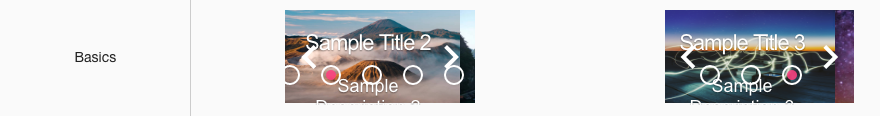
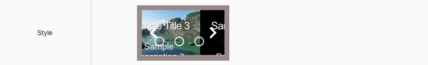
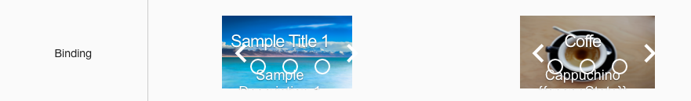
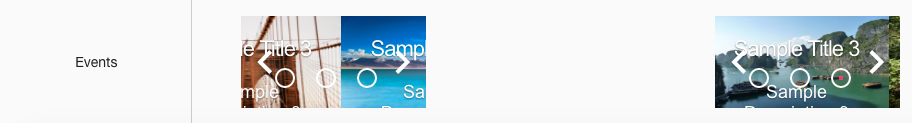

Sample Carousels
================

A Page with a full range of Sample Carousels is provided below in the Samples Application. By visiting the Sample Carousels
page you can test the functionality and play with the sample Carousels. By importing this page from the Github Samples
repository you will be able to use the samples in

* `Try Sample Carousels <http://50.22.58.40:3300/deploy/qa/Samples/web/1.0.1/index.html#/page.html?login=guest&name=SampleCarousels>`_
* Download Samples from Github

|

Sample Categories - different kinds of Carousel controls are provided as examples:

Basics
------

Basic Carousel samples show different labels, icons and colors. They have no event actions and therefore do nothing when clicked, etc.

|

Styles
------

Styles samples show examples of a color, shape and label changes.

|

Bindings
----------------

|

Events
------

|
|

