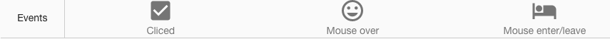

Sample Icons
============

A Page with a full range of Icons is provided below in the Samples Application. By visiting the Sample Icons
page you can test the functionality and play with the sample Icons. By importing this page from the Github Samples
repository you will be able to use the samples in your applications.

* `Try Sample Icons <http://50.22.58.40:3300/deploy/qa/Samples/web/1.0.1/index.html#/page.html?login=guest&name=SampleIcons>`_
* Download Samples from Github

|

Sample Categories - different kinds of icon controls are provided as examples:

|

Basics
------

Basic icons samples show different kinds of icons available in DreamFace.

The sample basic icons include:

* sample SVG icon
* sample wifi icon

|

Styles
------

Styles samples show examples of a color, shape and label changes.

|

Bindings
--------

|

Events
------

The events show clicked, double clicked, mouse over, mouse enter and mouse leave events.

|
|

