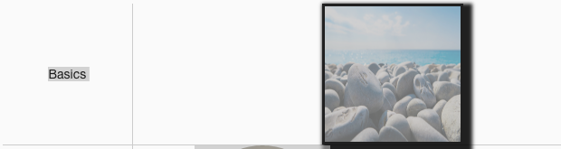
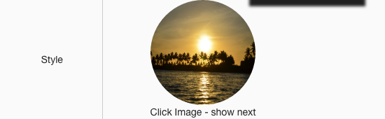
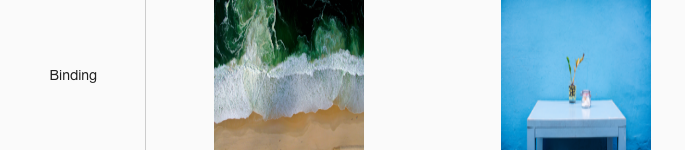
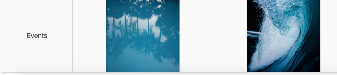

Sample Images
=============

A Page with a full range of Images is provided below in the Samples Application. By visiting the Sample Images
page you can test the functionality and play with the sample Images. By importing this page from the Github Samples
repository you will be able to use the samples in your applications.

* `Try Sample Images <http://50.22.58.40:3300/deploy/qa/Samples/web/1.0.1/index.html#/page.html?login=guest&name=SampleImages>`_
* Download Samples from Github

|

Sample Categories - different kinds of Image controls are provided as examples:

Basics
------

Basic Image samples show different labels, icons and colors.

|

Styles
------

Styles samples show examples of a color, shape and label changes in this case an image in a fab.

|

Bindings
----------------

|

Events
------

Also there are examples of the background and icon color change.

|
|

