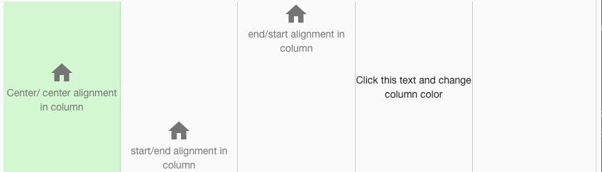
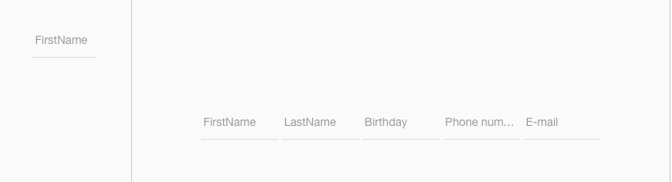

Sample Panels
=============

A Page with a full range of Sample Buttons is provided below in the Samples Application. By visiting the Sample Buttons
page you can test the functionality and play with the sample Buttons. By importing this page from the Github Samples
repository you will be able to use the samples in

* `Try Sample Buttons <http://50.22.58.40:3300/deploy/qa/Samples/web/1.0.1/index.html#/page.html?login=guest&name=SamplePanels>`_
* Download Samples from Github

|

Sample Categories - different kinds of Panel controls are provided as examples:

|

Length
------

Basic Input samples show different labels, icons and colors. They have no event actions and therefore do nothing when clicked, etc.

|

Events
------

Sample panels that with events.

|
