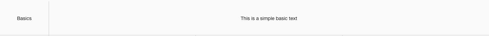
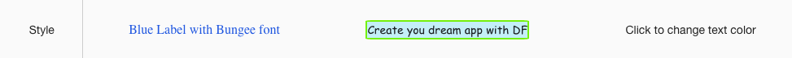
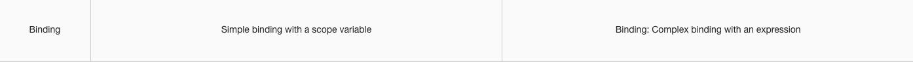
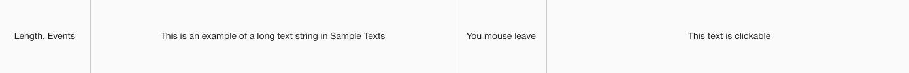

Sample Statictext
=================

A Page with a full range of Text controls is provided below in the Samples Application. By visiting the Sample Text
page you can test the functionality and play with the sample Statictext controls. By importing this page from the Github Samples
repository you will be able to use the samples in your applications.

* `Try Sample Staticexts <http://50.22.58.40:3300/deploy/qa/Samples/web/1.0.1/index.html#/page.html?login=guest&name=SampleTexts>`_
* :ref:`samples-github-label`

|

Sample Categories - different kinds of Statictext controls are provided as examples:

|

Basics
------

Basic Statictext samples show different labels with sample border styles.

|

Styles
------

Styles samples show examples of a color, shape and label changes, the first style has simple CSS styles set with the field
helpl in the properties. The second sample uses a CSS Class defined in the Styles editor and the third example uses
a Dynamic Class that is defined in the Stles Editor as well as a functin that is invoked by the Click event. When the text
is clicked the text toggles to red color and when clicked again it toggles back. The function is defined in the Script Editor.

|

Bindings
----------------

Binding samples show simple bindings using Sccope variables.

|

Events
------

The sample events show how to show text or hide it on mouse-enter, mouse-leave and click events.

|

