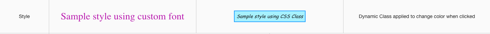

Sample Statictext
=================

A Page with a full range of Text controls is provided below in the Samples Application. By visiting the Sample Text
page you can test the functionality and play with the sample Statictext controls. By importing this page from the Github Samples
repository you will be able to use the samples in your applications.

* `Try Sample Staticexts <http://50.22.58.40:3300/deploy/qa/Samples/web/1.0.1/index.html#/page.html?login=guest&name=SampleTexts>`_
* Download Samples from Github

Sample Categories - different kinds of Statictext controls are provided as examples:

Basics
------

Basic Statictext samples show different labels, icons and colors. They have no event actions and therefore do nothing when clicked, etc.

.. image:: ../../images/devguide/samples/sample-text-basics.png

The sample basic buttons include:

* a button with a label
* a button with an icon
* a button with a label and an icon on the right
* a button with a label and an icon on the left.

|

Styles
------

Styles samples show examples of a color, shape and label changes (the first three buttons). The fab button with a
heart icon applies a dynamic class property to change the color of a heart when clicked. The last button in this category
has a drop-down menu which is activated by clicking on the arrow on the right hand side

|

Bindings
----------------

|

Events
------

Also there are examples of the background and icon color change.

|
|

