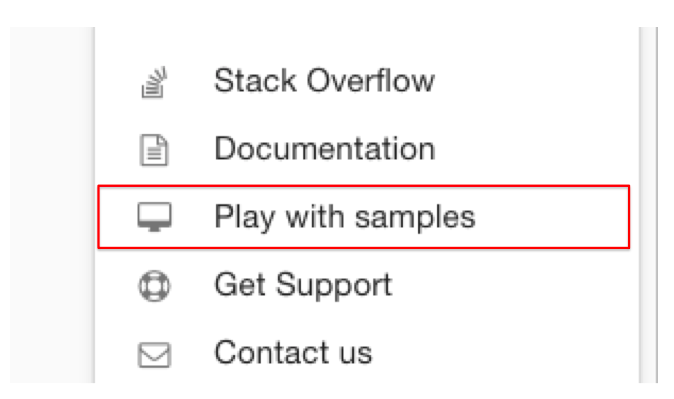
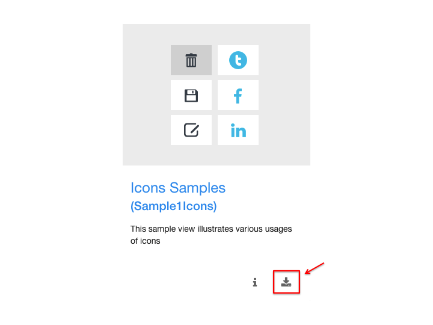
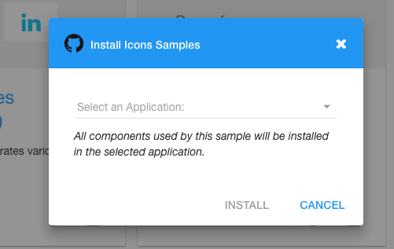

.. _samples-github-label:

Downloading Samples From Github
===============================

From the Help menu click on *Play with Samples*

|

The samples that are available for download will be displayed as cards.

.. image:: ../../images/devguide/dfx-help-playwithsamples.png
   :width: 400px
|

When you find a Sample that you would liket to download, click on the download icon on the bottom right of the card.

|

The download view will open and you can specify the application that you would like to download the sample to. The sample
will be added to the View components for your application in the Defalut category.

|

Return to the `Documentation Home <http://localhost:63342/dfd/build/index.html>`_.
